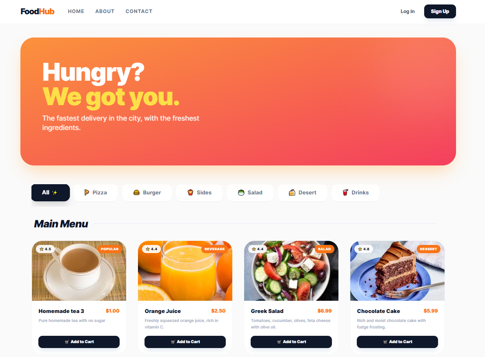
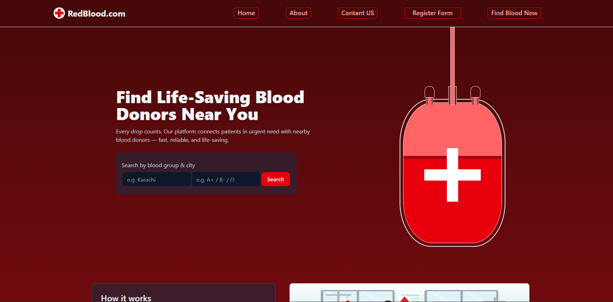

### 🚀 Quick Transmission

<table align="center">
  <tr style="display:grid; grid-template-columns: 1.5fr 1fr; border:none">
    <td style="border: 2px solid #30363d; border-radius:30px 0 0 30px; display:flex; align-items:center ">
    

      
<b>✨ Who am I?</b>

      
I'm a <b>Junior Full-Stack Developer</b> who transitioned from <b>Pre-Medical</b> to <b>Software Engineering</b>. I specialize in building logic out of chaos with the MERN stack.

      <ul>
        <li>🔭 <b>Working at:</b> Bano Qabil Incubation Center</li>
        <li>🌱 <b>Mastering:</b> Scalable Backend Architecture with TypeScript</li>
        <li>💬 <b>Ask me about:</b> React, Node.js & Databases</li>
      </ul>
    

    </td>
    <td  style="padding: 0; border: 2px solid #30363d;  border-radius:0 30px 30px 0; overflow:hidden">
        
    </td>
  </tr>
</table>

### 🛠️ My Tech Stack

<table style="display:grid; grid-template-columns: 1fr 1fr;">
  <tr style="display:flex; border:none; margin-bottom:10px">
    <td style="border: 2px solid #30363d; border-radius:20px 0 0 20px; display:flex; align-items:center; width:250px; font-size:18px" align="left"><b>🌐 Frontend Development</b></td>
    <td style="border:2px solid #30363d; width:300px; border-radius:0 20px 20px 0;" align="left">
      
    </td>
  </tr>
  <tr style="display:flex; border:none; margin-bottom:10px; background-color:transparent">
    <td style="border: 2px solid #30363d; border-radius:20px 0 0 20px; display:flex; align-items:center; width:250px; font-size:18px" align="left"><b>⚙️ Backend Development</b></td>
    <td style="border:2px solid #30363d; width:300px; border-radius:0 20px 20px 0;" align="left">
      

        
        
        
        
      

    </td>
  </tr>
  <tr style="display:flex; border:none; margin-bottom:10px">
    <td style="border: 2px solid #30363d; border-radius:20px 0 0 20px; display:flex; align-items:center; width:250px; font-size:18px" align="left"><b>🧰 Tools & Testing</b></td>
    <td style="border:2px solid #30363d; width:300px; border-radius:0 20px 20px 0;" align="left">
      
    </td>
  </tr>
</table>

### 🌟 Featured Projects

<table>
  <tr style="display:grid; grid-template-columns: 1fr 1fr; border:none">
    <td style="border: 2px solid #30363d; border-radius:30px 0 0 30px ">
      <h3>🍽️ FoodHub - Full-Stack Restaurant Web App</h3>
      
A comprehensive E-commerce solution with core functionalities:

      <ul>
        <li><b>Portals:</b> Dedicated Admin, User, and Public dashboards.</li>
        <li><b>Auth & Security:</b> Email verification (Nodemailer), Secure login (JWT, Bcrypt).</li>
        <li><b>Features:</b> Real-time order confirmation & automated email receipts.</li>
      </ul>
      
<b>Tech Stack:</b> TypeScript, Node.js, Express, MongoDB, Mongoose, Zod, JWT, Bcrypt, Nodemailer

    </td>
    <td style="padding: 0; border: 2px solid #30363d;  border-radius:0 30px 30px 0; overflow:hidden">
      
    </td>
  </tr>
</table>

<table>
  <tr style="display:grid; grid-template-columns: 1fr 1fr; border:none">
    <td style="border: 2px solid #30363d; border-radius:30px 0 0 30px ">
      <h3>🏏BQICL - Real-Time Cricket Auction System</h3>
      
A dynamic player bidding platform developed for the Bano Qabil Incubation tournament. Contributed as the <b>Frontend Developer</b>.

      <ul>
        <li><b>Collaboration:</b> Worked closely with Backend Developers for data sync.</li>
        <li><b>Scalability:</b> Used by 30+ PCs simultaneously during live events.</li>
        <li><b>Interface:</b> Built using EJS for server-side rendering.</li>
      </ul>
      
<b>Tech Stack:</b> EJS, JavaScript, CSS, Node.js, Express

    </td>
    <td  style="padding: 0; border: 2px solid #30363d;  border-radius:0 30px 30px 0; overflow:hidden">
      
    </td>
  </tr>
</table>

<table>
  <tr style="display:grid; grid-template-columns: 1fr 1fr; border:none;">
    <td style="border: 2px solid #30363d; border-radius:30px 0 0 30px; padding-bottom:20px">
      <h3>🩸 RedBlood - Blood Donation Finder</h3>
      
A specialized <b>Frontend Application</b> to connect donors with seekers. Focused on a clean, urgent-response UI.

      <ul>
        <li><b>Modern UI:</b> Mobile-first design for quick accessibility.</li>
        <li><b>Dynamic Filtering:</b> React-based searching for donors.</li>
        <li><b>Styling:</b> Tailwind CSS for a professional look.</li>
      </ul>
      
<b>Tech Stack:</b> React.js, Tailwind CSS, JavaScript (ES6+)

    </td>
    <td style="padding: 0; border: 2px solid #30363d;  border-radius:0 30px 30px 0; overflow:hidden">
      
    </td>
  </tr>
</table>

### 📊 GitHub Stats all

  

  
  

  

  
  

## 📊 GitHub Stats with normal sizes

  

## 🔝 Top Contributed Repo with normal sizes

  

## 📊 GitHub Stats with 70% sizes

  

## 🔝 Top Contributed Repo with 70% sizes

  

