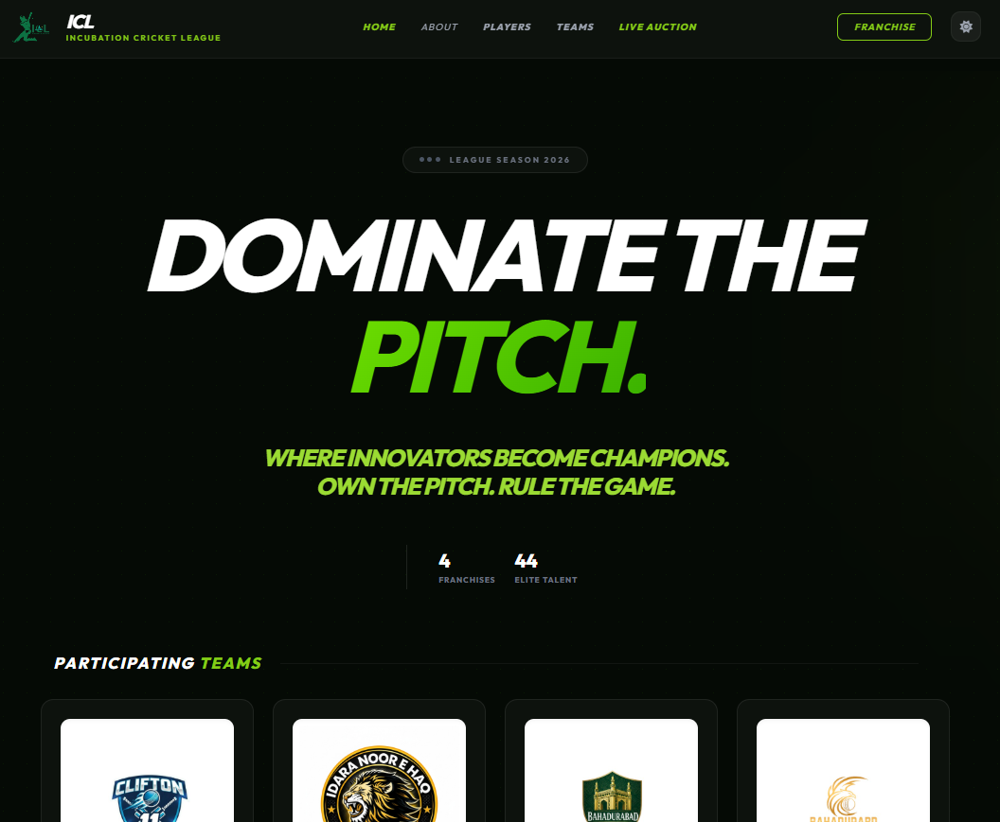
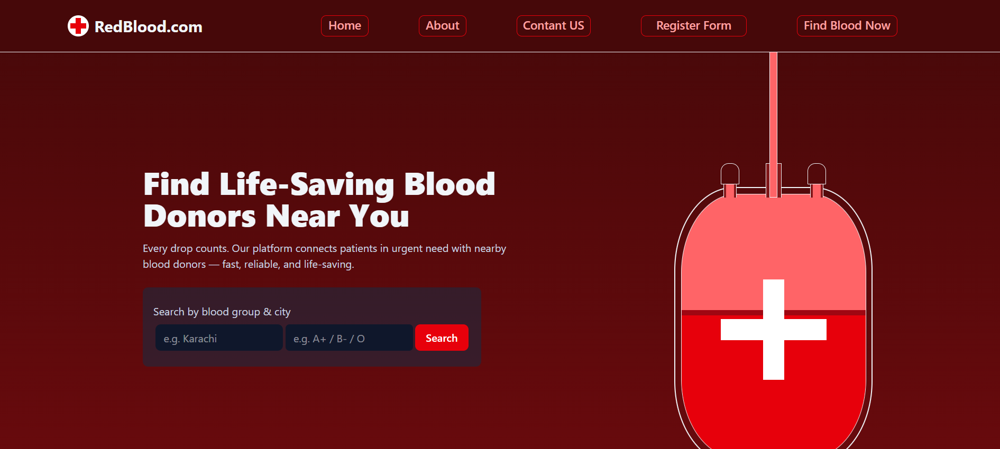

### 🚀 Quick Intro

<table align="center" width="100%">
  <tr>
    <td width="60%" style="border: 2px solid #30363d; padding:20px;">
      
<b>✨ Who am I?</b>

      
I'm a <b>Junior Full-Stack Developer</b> who transitioned from <b>Pre-Medical</b> to <b>Software Engineering</b>. I specialize in building logic out of chaos with the MERN stack.

      <ul>
        <li>🔭 <b>Working at:</b> Bano Qabil Incubation Center</li>
        <li>🌱 <b>Mastering:</b> Scalable Backend Architecture with TypeScript</li>
        <li>💬 <b>Ask me about:</b> React, Node.js & Databases</li>
      </ul>
    </td>
    <td width="40%" style="border: 2px solid #30363d; padding:0;">
      
    </td>
  </tr>
</table>

### 🛠️ My Tech Stack

<table width="100%">
  <tr>
    <td width="30%" style="border: 2px solid #30363d; padding:15px;"><b>🌐 Frontend Development</b></td>
    <td width="70%" style="border: 2px solid #30363d; padding:15px;">
      
    </td>
  </tr>

  <tr>
    <td style="border: 2px solid #30363d; padding:15px;"><b>⚙️ Backend Development</b></td>
    <td style="border: 2px solid #30363d; padding:15px;">
      
    </td>
  </tr>

  <tr>
    <td style="border: 2px solid #30363d; padding:15px;"><b>🧰  Tools & Testing</b></td>
    <td style="border: 2px solid #30363d; padding:15px;">
      
    </td>
  </tr>
</table>

### 🌟 Featured Projects

<table width="100%" cellspacing="0" cellpadding="0">
  <tr>
    <td width="50%" style="border: 2px solid #30363d; padding:20px;">
      <h3>🍽️ FoodHub - Full-Stack Restaurant Web App</h3>
      
A comprehensive E-commerce solution with core functionalities:

      <ul>
        <li><b>Portals:</b> Dedicated Admin, User, and Public dashboards.</li>
        <li><b>Auth & Security:</b> Email verification (Nodemailer), Secure login (JWT, Bcrypt).</li>
        <li><b>Features:</b> Real-time order confirmation & automated email receipts.</li>
      </ul>
      
<b>Tech Stack:</b> TypeScript, Node.js, Express, MongoDB, Mongoose, Zod, JWT, Bcrypt, Nodemailer

    </td>
    <td width="50%" style="border: 2px solid #30363d; padding:0; margin:0;">
      
    </td>
  </tr>
</table>

<table width="100%">
  <tr>
    <td width="50%" style="border: 2px solid #30363d; padding:20px;">
       <h3>🏏BQICL - Real-Time Cricket Auction System</h3>
      
A dynamic player bidding platform developed for the Bano Qabil Incubation tournament. Contributed as the <b>Frontend Developer</b>.

      <ul>
        <li><b>Collaboration:</b> Worked closely with Backend Developers for data sync.</li>
        <li><b>Scalability:</b> Used by 30+ PCs simultaneously during live events.</li>
        <li><b>Interface:</b> Built using EJS for server-side rendering.</li>
      </ul>
      
<b>Tech Stack:</b> EJS, JavaScript, CSS, Node.js, Express

    </td>
    <td width="50%" style="border: 2px solid #30363d; padding:0;">
      
    </td>
  </tr>
</table>

<table width="100%">
  <tr>
    <td width="50%" style="border: 2px solid #30363d; padding:20px;">
      <h3>🩸 RedBlood - Blood Donation Finder</h3>
      
A specialized <b>Frontend Application</b> to connect donors with seekers. Focused on a clean, urgent-response UI.

      <ul>
        <li><b>Modern UI:</b> Mobile-first design for quick accessibility.</li>
        <li><b>Dynamic Filtering:</b> React-based searching for donors.</li>
        <li><b>Styling:</b> Tailwind CSS for a professional look.</li>
      </ul>
      
<b>Tech Stack:</b> React.js, Tailwind CSS, JavaScript (ES6+)

    </td>
    <td width="50%" height="100%" style="border: 2px solid #30363d; padding:0;">
      
    </td>
  </tr>
</table>

### 📊 GitHub Stats

  

  

